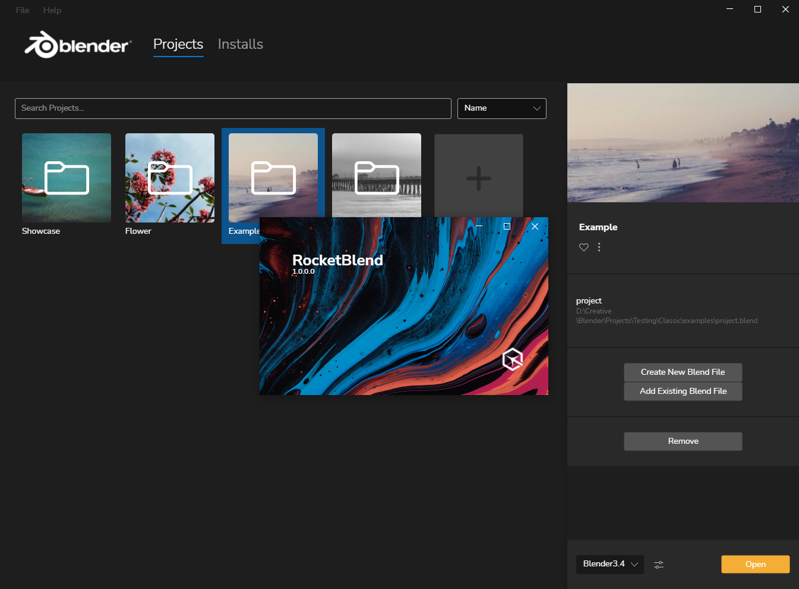
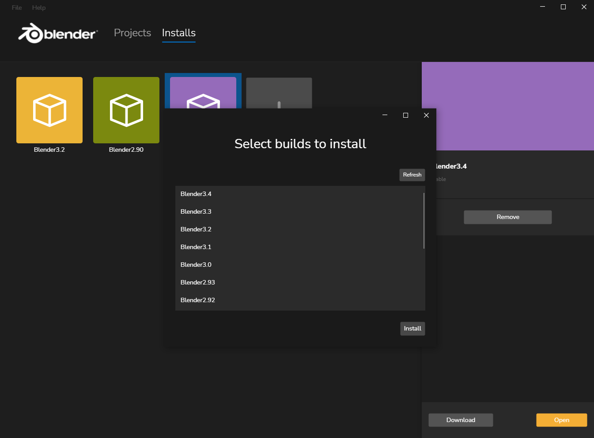

## Project Is Deprecated In Favour Of [RocketBlend Desktop](https://github.com/rocketblend/rocketblend-desktop)

# RocketBlend Classic

RocketBlend Classic is a standalone GUI software client that provides management for builds of [Blender](https://www.blender.org/) builds. Written in .Net 6 and [Avalonia UI](https://avaloniaui.net/).

I've since moved on to [RocketBlend](https://github.com/rocketblend/rocketblend) and taken a different approach to the problem. **RocketBlend Classic is not actively maintained**. There's a number of issues and is missing a lot of polish but It provides a good starting point for anyone wanting to build something similar.

## Acknowledgments

- Inspired by [Blender Launcher](https://github.com/DotBow/Blender-Launcher)

## Screenshots

